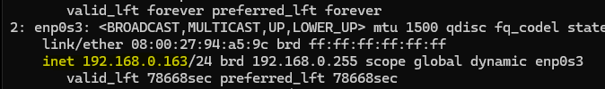
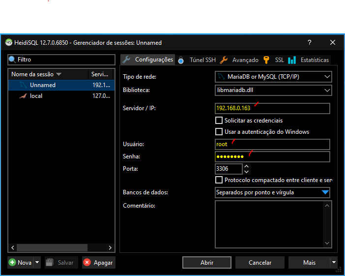
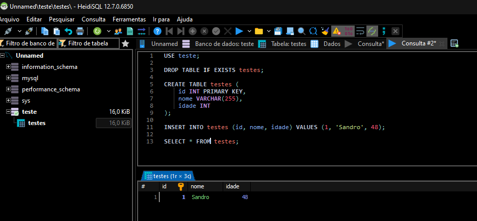

## 1 Realizar download de imagem docker

Acesse o -[docker.hub](https://hub.docker.com/), faça o cadastro se necessário

- Pesquise pelo hello-word e copie o comado fornecido
````bash
    docker pull hello-world
````
- Ele trás a ultima versão da imagem
- Verificando as imagens baixadas
````bash
    docker images
````

- Executando a imagem
````bash
    docker run hello-world
````

- Verificado os containers em execução
````bash
    docker ps
````

- Verificado os containers em executados recentemente
````bash
    docker ps -a
````

---

## 2 Exexcuando um container

- Baixando ultima versão do ubutu no repositorio
````bash
    docker pull ubuntu
````

- Executando container ubuntu
````bash
    docker run ubuntu
````
- **OBS:** o container executa e para


- Executando container ubuntu por 10 segundos
````bash
    docker run ubuntu sleep 10
````
- **OBS:** o container prende o terminal por 10 segundos
 
 ### Parar container em execução

- Executando container ubuntu por 1500 segundos
````bash
    docker run ubuntu sleep 1500
````
- Abra outra aba do terminla, acesse a maquina virtual via ssh root@meu-ip e execute o comando
````bash
    docker ps
````
- **OBS:**  agora a maquina esta rondado
````bash
    docker ps
````

- Parar a execução do container
- utilize o id ou nome gerardo automaicamente
````bash
    docker stop 20c287db4f47
````

### Acessar o bash de um container ubuntu

- Para ver os comandos ``docker run``
````bash
    docker run --help
````

- ``i`` - aciona o modo iterativo, para iteragir com o container
- ``t`` - Aloca um pseudo terminal
````bash
    docker run -it ubuntu
````
- Sair do container Ubuntu
````bash
    exit
````
- Observe que ele não fica em execução

## 3 Velha sintase VS nova sintaxe

- Sintaxe antiga e mais reduzida

    - ``docker ps``
    - ``docker ps -a``
    - ``docker run``

- Sintaxe nova adiciona o ``container`` a frente do ``docker``

    - ``docker container ps -a``
    - ``docker container run``
    - ``docker container ls``

--- 

## 4 Executar aplicações em um container

- Mostra os parametros do run
````bash
    docker run --help
````
- ``d`` - executa um conttainer em background e printa o ID completo do conatiner
- ``i`` - aciona o modo iterativo, para iteragir com o container
- ``t`` - Aloca um pseudo terminal
````bash
    docker run -dti ubuntu
````
- **OBS** Após executar este comando o terminal fica livre e o container esta em execução.

### Executar comandos ou instalações em um container

- Executando um comando para acessa o bash de um container
- ``exec`` para executar um comando
````bash
    docker exec -it f40 /bin/bash
````
- **OBS** Pode utilizar so os primeiros numeros do ID, se não tiver outro cm o mesmo inicio

- Se tentar usar o nano ele não esta instalado, lembre-se de que uma imagem tem o minimo para o sistema operacional funcionar
- Atualize os repositorios para instalar recurso no container Ubuntu
````bash
    apt update
    apt upgrade
````

- Instale nano
````bash
    apt -y install nano
````

- Sair do container
````bash
    exit
````
- **OBS** O container ainda esta em execução

- Executando um comando
````bash
    docker exec -it f40 cat /etc/*release*
````
- **OBS** Ele executa o comando, printa as informções e sai do container. o mesmo ainda esta em execução

- Para o container
````bash
    docker stop f40 
````

---

## 5 Excluindo e nomeando containers

- Excluindo container ``docker rmi <id-container>``
````bash
    docker rm 69f
````
- Excluindo image ``docker rmi <nome-da-image>``
````bash
    docker rmi hello-world
````

- Baixando uma imagem e executando o container
````bash
    docker run -dti centos
````
- **OBS** Primero ele procura a imagem local, caso não encontre, faz o download do repositorio para o container ``docker stop id-container`` e exclua o mesmo ``docker rm id-container``

- Nomeando o container ```docker run dti -name <Nome-do-conatainer> image``
````bash
    docker run -dti --name Ubuntu-A ubuntu
    docker run -dti --name Ubuntu-B ubuntu
    docker run -dti --name Centos-A centos
````

- Agora temos  3 containers em execução

---

## 6 Copiando arquivos para um container

- crie os arquivos ex nano ``nano arquivo1.txt``
- Criando um diretorio no Ubuntu-A e enviando uma copiando do arquivo1.txt de fora do container
````bash
    docker exec Ubuntu-A mkdir /destino
````

- Verificar se foi criado
````bash
    docker exec Ubuntu-A ls /
````

- Enviando arquivo
````bash
    docker cp arquivo1.txt Ubuntu-A:/destino
````

- Verificar se foi enviado
````bash
    docker exec Ubuntu-A ls /destino -l
````

- Enviado mais de um arquivo
- Instale um zip, comando: ``apt install -y zip``
- Zipar todos os arquivos txt, comando: ``zip meuZip.zip *.txt``
- Enviando arquivo zip
````bash
    docker cp meuZip.zip Ubuntu-A:/destino
````
- Para descompactar primerio será preciso acessar o Ubuntu-A ``docker exec -ti Ubuntu-A /bin/bash`` entrar no diretorio ``cd /destino`` atualizar o repositorio do  ``apt update`` && ``apt upgrade`` instalar o zip ``apt install -y zip`` e descompactar ``unzip meuZip.zip``

## 7 Copiar arquivo de um container

- Copiando arquivo do container para máquina principal e renomeando 
````bash
    docker cp Ubuntu-A:/destino/Meuzip.zip Zipcopia.zip
````
- Verificando se o zip foi copiado ``ls -l``

## 8 Tags

- Baixar uma imagem específica, vá até o docker.hub e procure por exemplo Debian, irá aparecer várias variações do Debian

- O comando docker pull debian,baixa a última imagem atualizada. O comando ``docker pull debian:9``, baixa a versão 9.
- Após concluir o download da imagem, comando docker images mostra as images mostra as imagens baixadas. Para rodar o container utilize o comando ``docker run -dti debian:9``, ele gera um nome aleatório para o container.
- Com o comando ``docker ps``,listamos os containers em execução, ``docker stop nome-container``, para o container ``docker rm nome-container``, remove o container.

## 9 Criando um container do MYSQL

**Essa abordagem só instala MYSQL minizando o uso de memória e espaço, mas também podemos baixar uma imagem de um sistema operacional e instalar o banco de dados.**

- Nesse cenário e necessário configurar algumas variáveis, como senha e usuário. Também podemos configurar o nome do banco de dados mas está e opcional.
- Baixando imagem atual ``docker pull mysql`` e verificando a imagem ``docker images`` 

- Executado e configurando porta, nome do container, usuário e senha.
````bash
    docker run -e MYSQL_ROOT_PASSWORD=senha123 --name nome-container -d -p 3306:3306 mysql
````

- Esse container demora um pouco mais para finalizar a execução devido a configuração do MYSQL. Você pode acessar o container mas o MYSQL pode estar instalando ainda.
- ``docker ps`` Para ver se esta tudo certo agora, solicitamos um bash para  interagir com o container.
````bash
    docker exec -it nome-container bash
````
- Para acessar o banco de dados, utilizamos o protocolo TCP
````bash
    mysql -u root -p --protocol=tcp
````
- Há senha será solicitada, digite a senha criada em seguida pressione entre.
- **Obs:** pode dar erro se o MYSQL na estiver rodando no container, aguarde e depois repita o processo.

### Manipulando banco de dados.

- Aqui usamos os Scripts padrão SQL para manipular o banco de dados
- Criando um banco de dados com ``CREATE DATABASE teste;``
- Visualizando os bancos de dados instalados com``Show databases``;
- Perceba que o MYSQL já vem com alguns bancos instalados por padrão.
- Para sair do BD digite ``exit``
- Para sair do container ``exit``
- Para analisar os parâmetros do container.
````bash
    docker inspect nome-container
````
- Você tambem pode acessar o mysql direto da maquina fisica, basta deixar a porta Bridged habilitada na maquina virtual e ter algum client para se conectar ao banco.
- O Docker cria um dispositivo de rede por padrão e é através dele se o MYSQL cliente estiver instalando na máquina virtual, o podemos manipular o Banco de dados. Para instalar o client do mysql execute o comando. ``apt -y install mysql-client``
- Agora para acessar direto da máquina virtual basta executar o comando ``mysql -u root -p --protocol=tcp``

## 9 Acessando o container da máquina física.

- Estamos executando os containers em uma máquina virtual, para acessar os containers da máquina física a placa de rede da máquina virtual deve estar em modo *Bridged*. Execute o comando abaixo na máquina virtual, para saber qual e seu IP.
````bash
    ip a
````
- Imagem do bash


- Agora podemos através desse IP usar qualquer client na máquina física para manipular o banco de dados


- Aqui utilizamos o HeidiSQL
````SQL
    USE teste;

    DROP TABLE IF EXISTS testes;

    CREATE TABLE testes (
        id INT PRIMARY KEY,
        nome VARCHAR(255),
        idade INT
    );

    INSERT INTO testes (id, nome, idade) VALUES (1, 'Sandro', 48);

    SELECT * FROM testes;
````
- Painel do HeidiSQL


## 10 Parando e reiniciando o container 

- Na máquina virtual executamos os comandos abaixo para parar e iniciar o container, reparem que ao inciar o container a tabela criada continua foi persistia.
```` bash
    docker stop nome-container 
    docker start nome-container 
    mysql -u root -p --protocol=tcp 
````
````SQL
    use teste;
    SELECT * FROM testes;
    exit
````
````bash
    docker stop nome-container 
    docker rm nome-container
````
- Os dados foram perdidos, pois o container foi removido. Para evitar estes acidentes precisamos mapear o local de armazenamento dos dados, assim quando o container for excluído podemos recriar e utilizar os dados novamente.