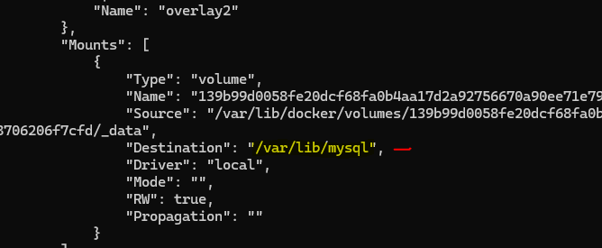
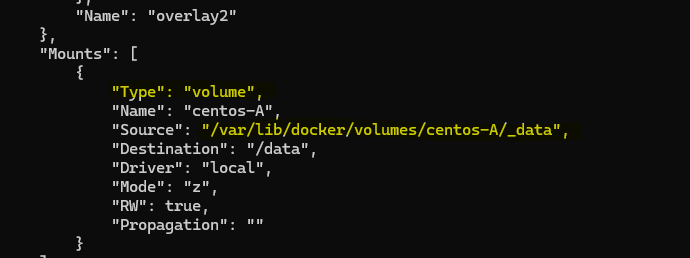
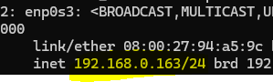
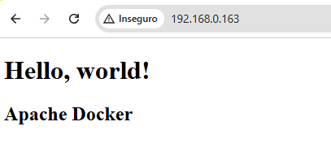
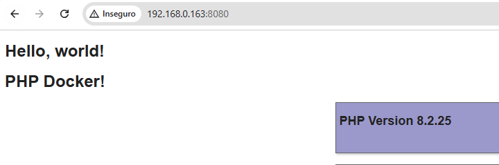

# 2. Armazenamento de dados

- Para encontrar o caminho onde o container armazena os dados, utilizamos o comando `docker inspect nome-container`.
- Um arquivo JSON será apresentado. Procure por "Mounts" e "Destination" para encontrar o caminho.



- Agora, criaremos um diretório para persistir os dados do container:

  ```bash
    mkdir data
    mkdir data/mysql-A
  ```

  ```bash
    docker run -e MYSQL_ROOT_PASSWORD=senha123 --name mysql-A -d -p 3306:3306 --volume=/data/mysql-A:/var/lib/mysql mysql
  ```

- Com o comando `ls /data/mysql-A`, podemos observar que os dados estão no diretório.

- Acessando o banco de dados e criando conteúdo:

  ```bash
    mysql -u root -p --protocol=tcp --port=3306
  ```

- Criando uma tabela e inserindo dados:

  ```sql
    CREATE DATABASE aula;
    USE aula;
    CREATE TABLE alunos (
        id INT PRIMARY KEY,
        nome VARCHAR(255)
    );
    INSERT INTO alunos (id, nome) VALUES (1, "Julio");
    SELECT * FROM alunos;
    EXIT;
  ```

- Parando e apagando o container:

  ```bash
    docker stop mysql-A 
    docker rm mysql-A 
  ```

- Acessando o diretório criado com `ls data/mysql-A`:

- Os dados estão salvos. Para usá-los novamente, basta apontar para o diretório ao executar o container.

## Montando Mount Bind e Named Volume

- **Mount Bind**: `docker run -v /hostdir:/containerdir nome-imagem`. Esta abordagem foi utilizada anteriormente. Podemos usar `-v` ou `--volume`.

- **Named Volume**: Utilizamos o comando `docker volume create nome-volume` para criar um volume que será salvo no diretório padrão do Docker `/var/lib/docker/`.

  ```bash
    docker volume create mysql_data
    docker run -v mysql_data:/containerdir mysql
  ```

- **Dockerfile**: O volume é utilizado junto com o `Dockerfile` para criar scripts com os volumes já configurados.

## Exemplos de Mount

### Tipos de Bind

- Criando nossa estrutura **OBS**: as pastas precisam ser criadas conforme o exemplo:

  ```bash
    mkdir /data
    mkdir /data/debian-A
    mkdir /data/apache-A
    mkdir /data/php-A
    cd /data/debian-A
    touch arquivo.txt
    touch arquivo2.txt
    cd ..
    cd ..
  ```

- Mapeando os volumes:

  ```bash
    docker run -dti --mount type=bind,src=/data/debian-A,dst=/data --name debian-container debian
  ```

- Executando um bash para manipular o container: `docker exec -ti debian-container bash`.

- Verificando se os conteúdos estão no container:

  ```bash
    ls -l
    cd data
    ls
  ```

- Criando um novo arquivo no diretório do container: `touch arquivo3.txt`.

- Saindo do modo bash: `exit`.

- Verificando se o `arquivo3.txt` foi persistido no diretório da nossa estrutura:

  ```bash
    cd /data/debian-A
    ls
  ```

- Criando um volume do tipo bind somente para leitura:

  ```bash
    docker stop debian-container 
    docker rm debian-container 
  ```

- Agora, acrescentamos o parâmetro `ro` (read-only):

  ```bash
    docker run -dti --mount type=bind,src=/data/debian-A,dst=/data,ro --name debian-container debian
    docker exec -ti debian-container bash
  ```

- Vamos tentar excluir um arquivo e criar outro:

  ```bash
    cd /data/
    ls
    rm arquivo.txt
    touch arquivo4.txt
  ```

- Um erro será lançado para cada operação.

### Volume

- Listando os volumes criados com `docker volume ls`.

- Criando volumes no diretório padrão do Docker:

  ```bash
    docker volume create data-debian
  ```

- O caminho para esse diretório é `/var/lib/docker/volumes`.

- Dentro da pasta `volumes`, está o diretório criado. Dentro dele, foi criado um novo diretório: `/data-debian/_data`.

- Vamos criar alguns arquivos nele:

  ```bash
    touch arquivo1.txt
    touch arquivo2.txt
  ```

- Vamos subir dois containers e acessar o mesmo volume `/data-debian`:

  ```bash
    docker run -dti --mount type=volume,src=data-debian,dst=/data --name debian-v-container debian
    docker exec -ti debian-v-container bash
    ls
    cd /data
    touch arquivo3.txt
    exit
    ls /data-debian/_data
    docker run -dti --mount type=volume,src=data-debian,dst=/data --name debian-v2-container debian
    docker exec -ti debian-v2-container bash
    ls
    cd /data
    touch arquivo4.txt
    exit
    ls /data-debian/_data
    docker stop debian-v-container
    docker stop debian-v2-container
    docker rm debian-v-container
    docker rm debian-v2-container
    docker volume rm data-debian
  ```

## Concluindo Mount

- Comandos adicionais:

  ```bash
    docker volume create centos-A
    docker run -dti --mount type=volume,src=centos-A,dst=/data --name centos-A centos
    docker inspect centos-A
  ```

  

- Excluir sem precisar parar o container:

  ```bash
    docker rm -f centos-A
  ```

- Excluir tudo o que está em volume:

  ```bash
    docker volume prune
  ```

- Excluir todos os containers que estão parados:

  ```bash
    docker container prune
    docker ps -a
  ```

### Exemplo Apache

- No [Docker Hub](https://hub.docker.com/), pesquisamos pelo servidor [Apache](https://hub.docker.com/_/httpd), onde encontramos informações relevantes sobre a criação dos arquivos e o comando para baixar a imagem oficial: `/usr/local/apache2/htdocs/`.

- Criamos um diretório para mapear os volumes:

  ```bash
    mkdir /data/apache-A
  ```

- Entramos na pasta, criamos um arquivo `index.html` e editamos o conteúdo:

  ```bash
    nano index.html
  ```

  Conteúdo do `index.html`:

  ```html
  <!doctype html>
    <html lang="en">
      <head>
        <meta charset="utf-8">
        <meta name="viewport" content="width=device-width, initial-scale=1">
        <title>Bootstrap demo</title>
      </head>
      <body>
        <h1>Hello, world!</h1>
        <h2>Apache Docker!</h2>
      </body>
    </html>
  ```

- Agora, mapeamos a pasta para o container:

  ```bash
    docker run --name apache-A -d -p 80:80 --volume=/data/apache-A:/usr/local/apache2/htdocs httpd
  ```

- O container está ouvindo a porta 80 do host. Para saber o IP, use o comando `ip a`.



- Agora, no navegador da máquina física, insira o IP:



- Qualquer alteração feita no arquivo `index.html` será atualizada automaticamente.

### Exemplo PHP

- No [Docker Hub](https://hub.docker.com/), pesquisamos pela imagem [PHP](https://hub.docker.com/_/php), onde encontramos informações sobre onde os arquivos são criados e o comando para baixar a imagem oficial. No entanto, este PHP não vem com o Apache, então precisamos de um comando alternativo:

  ```bash
    docker pull php:8.2-apache
  ```

- Criamos um diretório para mapear os volumes:

  ```bash
    mkdir /data/php-A
  ```

- Entramos na pasta, criamos um arquivo `index.php` e editamos o conteúdo:

  ```bash
    nano index.php
  ```

  Conteúdo do `index.php`:

  ```html
  <!doctype html>
    <html lang="en">
      <head>
        <meta charset="utf-8">
        <meta name="viewport" content="width=device-width, initial-scale=1">
        <title>Bootstrap demo</title>
      </head>
      <body>
        <h1>Hello, world!</h1>
        <h1>PHP Docker!</h1>
        <?php
        phpinfo();
        ?>
      </body>
    </html>
  ```

- Agora, mapeamos a pasta para o container, usando outra porta, pois o Apache está em execução:

  ```bash
    docker run --name php-A -d -p 8080:80 --volume=/data/php-A:/var/www/html php:8.2-apache
  ```

- Agora, no navegador da máquina

 física, insira o IP, seguido da porta mapeada.



- Qualquer alteração feita no arquivo `index.php` será atualizada automaticamente.

---

