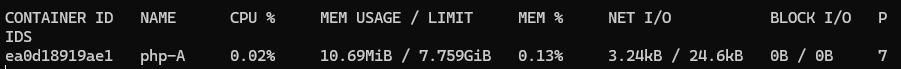
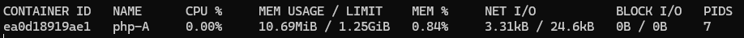
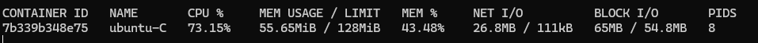
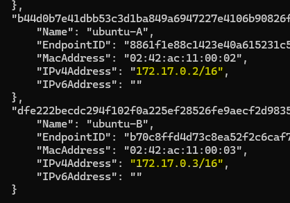
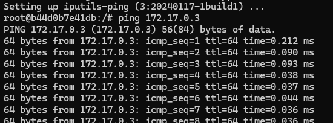
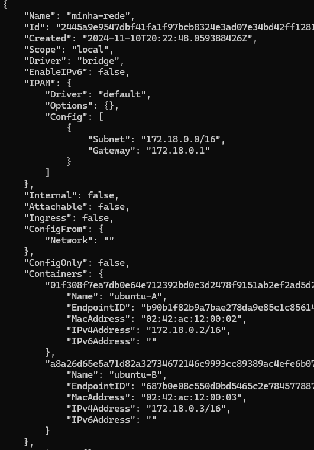
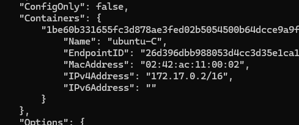

# Processamento, Logs e Rede

## Limitando a Memória e CPU

- Para visualizar o consumo de recursos, utilize o comando:
```bash
    docker stats php-A
```

- Saída:


- Para evitar que o container utilize todo o recurso da máquina virtual e cause a sobrecarga do sistema, podemos limitar os recursos. Neste exemplo, vamos usar o comando `docker update`.

```bash
    docker update php-A -m 1280m --cpus 0.2
```

- Estamos limitando a memória a `-m 1280m` (1280 megabytes) e o CPU a `--cpus 0.2` (20% do CPU da máquina virtual).

- Use o comando `docker stats php-A` para verificar o status novamente.
 

- Perceba que os limites foram alterados.

- Passando os parâmetros na criação do container:
```bash
    docker run --name ubuntu-C -dti -m 128m --cpus 0.2 ubuntu
```

- Vamos interagir com esse novo container através do bash:
```bash
    docker exec -ti ubuntu-C bash
```

- Instalando um programa para estressar o sistema:
```bash
    apt update
    apt -y install stress
```

- O comando `stress --help` exibe a lista de argumentos disponíveis para uso:
```bash
    stress --cpu 1 --vm-bytes 50m --vm 1 --vm-bytes 50m
```

- A quantidade de CPU, o volume de dados que será alocado, a quantidade de pacotes e o tamanho de cada pacote podem ser configurados. O terminal ficará preso até que o comando seja interrompido.

- Abra outro terminal e acesse a máquina virtual para observar a alteração:


- Você pode estressar ainda mais o sistema. Volte para o terminal onde o `stress` está em execução, pressione `Ctrl + C` para sair e execute um novo estresse. Lembre-se de que o limite nunca será ultrapassado:
```bash
    stress --cpu 1 --vm-bytes 150m --vm 1 --vm-bytes 100m
```

---

## Informações de Log e Processos

Comandos importantes:

- `docker info`: Exibe informações sobre o servidor, como containers em execução, containers pausados, quantidade de imagens, versão do Docker, sistema operacional, quantidade de CPU e memória.
- `docker container logs nome-container`: Exibe os logs do container.
- `docker container top nome-container`: Exibe os processos em execução dentro do container.

---

## Redes

- Ao executar `ip a` no host, vemos um dispositivo de rede virtual onde estamos usando a rede *host*, padrão do Docker.
- Ao executar o comando `docker network --help`, temos uma lista de comandos disponíveis para uso. Exemplo: `docker network ls` lista as redes disponíveis. Lá, observamos que também temos a rede *bridge*. Todo container criado é adicionado a essa rede, que tem acesso à rede *host*.
- O comando `docker inspect bridge` mostra todos os containers adicionados à rede. Como os containers estão na mesma rede, eles têm acesso entre si. Portanto, se não fornecermos a rede ao criar o container, ele será automaticamente adicionado à rede *bridge*.

- Vamos criar dois containers:
```bash
    docker run --name ubuntu-A -dti ubuntu
    docker run --name ubuntu-B -dti ubuntu
```
Agora, vamos inspecionar as redes:
```bash
    docker inspect bridge
```


- Eles estão na mesma rede.

- Agora, vamos executar um bash no `ubuntu-A`:
```bash
    docker exec -ti ubuntu-A bash
```
E instalar o `ip config`:
```bash
    apt update
    apt-get install -y iputils-ping
```

- Agora temos o `ping` instalado. Vamos "pingar" o `ubuntu-B`:
```bash
    ping 172.17.0.3
```


- Temos a confirmação de que os containers estão na mesma rede. Use `exit` para sair do container e `exit` novamente para sair do terminal.

- Agora vamos excluir os dois containers:
```bash
    docker rm -f ubuntu-A ubuntu-B
```

- No entanto, podemos criar uma rede para isolar os containers desejados.

### Criando uma Rede

```bash
    docker network create minha-rede
```
- Este comando cria uma nova rede e uma sub-rede.

- Vamos criar os containers nessa nova rede:
```bash
    docker run -dti --name ubuntu-A --network minha-rede ubuntu
    docker run -dti --name ubuntu-B --network minha-rede ubuntu
```

- Ao executar o comando `docker inspect minha-rede`, observamos que os containers estão isolados:


- Agora vamos criar um container na rede padrão:
```bash
    docker run -dti --name ubuntu-C ubuntu
```

- E vamos inspecionar seus IPs com:
```bash
    docker inspect bridge
```
Copie o IP do `ubuntu-C`:


- Agora, execute um bash no `ubuntu-A`:
```bash
    docker exec -ti ubuntu-A bash
```
E instale o `ping`:
```bash
    apt update
    apt-get install -y iputils-ping
```

Agora, vamos tentar "pingar" o `ubuntu-B`:
```bash
    ping 172.18.0.3
```
Nós temos resposta, mas se tentarmos "pingar" o `ubuntu-C`:
```bash
    ping 172.17.0.2
```
Não teremos sucesso, pois os containers estão em redes diferentes.

- Finalmente, vamos excluir os containers criados:
```bash
    docker rm -f ubuntu-A ubuntu-B ubuntu-C
```

- E excluir a rede criada:
```bash
    docker network rm minha-rede
```
