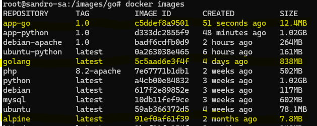

# Definição e Criação de um Dockerfile

## Primeiro Dockerfile

- Criando o Dockerfile manualmente

```bash
# Criando container Ubuntu
docker run -dti --name ubuntu-python ubuntu
# Executando bash
docker exec -ti ubuntu-python bash
# Atualizando pacotes
apt update
# Instalando Python 3 e o editor nano
apt install -y python3 nano
# Limpando os arquivos .deb que foram baixados
apt clean
# Acessando a pasta /opt
cd /opt
# Criando um arquivo .py
nano app.py
```

- Dados para inserir no editor

```python
nome = input("Qual seu nome?")
print(nome)
```

- Salvar e sair do editor.

- Executando o app

```bash
# Executando o app
python3 app.py
# Saindo do bash
exit
# Executando o app diretamente do host
docker exec -ti ubuntu-python python3 /opt/app.py
# Parando o container
docker stop ubuntu-python
# Excluindo o container
docker rm -f ubuntu-python
```

- Criando diretório para imagens

```bash
mkdir /images
cd /images
mkdir ubuntu-python
cd ubuntu-python
nano app.py
```

- Dados para inserir no editor

```python
nome = input("Qual seu nome?")
print(nome)
```

- Criando o Dockerfile

```bash
nano dockerfile
```

- Dados para inserir no editor

```dockerfile
# Qual a imagem base?
FROM ubuntu
# Quais comandos vamos executar
RUN apt update && apt install -y python3 && apt clean
# Copiando o arquivo para o container
COPY app.py /opt/app.py
# Executando o app
CMD python3 /opt/app.py
```

- Salvar e sair.
- Construindo a imagem

```bash
# O ponto (.) indica que estamos no mesmo diretório, e o nome da imagem
docker build . -t ubuntu-python
```

- Repare que ele vai executar todos os passos que fizemos manualmente.
- Com o comando `docker images`, podemos ver a imagem criada.
- Agora, para executar o container:

```bash
# Não utilizamos o parâmetro -d, pois não queremos o container em segundo plano
docker run -ti ubuntu-python
```

- Repare com o comando `docker ps -a` que o container para após você responder seu nome e apertar Enter.

---

## Criando uma imagem personalizada do Apache (Web Server)

- Acesse a pasta `images` criada anteriormente e execute os comandos:

```bash
# Criando diretório
mkdir debian-apache
# Acessando o diretório
cd debian-apache
# Criando diretório 'site' para armazenar os arquivos
mkdir site
# Acessando o diretório 'site'
cd site
```

- Abra outro terminal e instale o [WinSCP](https://winscp.net/eng/download.php), caso não tenha ele disponível.

```bash
# Aqui você pode pegar um exemplo de site pronto na web e salvar no seu PC, depois envie-o para a máquina virtual
scp "D:\front_end\site.zip" root@192.168.0.163:/images/debian-apache/site
```

- De volta ao terminal da máquina virtual:

```bash
# Descompactando o arquivo zip
unzip site.zip
# Apagando o arquivo zip
rm site.zip
# Criando um arquivo .tar com todos os arquivos da página. O Docker extrai automaticamente o arquivo tar.
tar -czf site.tar ./
# Copiando o arquivo .tar para o diretório debian-apache
cp site.tar ../
# Removendo o diretório site
rm -Rf site
# Criando o Dockerfile
nano dockerfile
```

- Criando o Dockerfile

```dockerfile

    FROM debian

    RUN apt-get update && apt-get install -y apache2 && apt-get clean

    ENV APACHE_LOCK_DIR="/var/lock"
    ENV APACHE_PID_FILE="/var/run/apache2.pid"
    ENV APACHE_RUN_USER="www-data"
    ENV APACHE_RUN_GROUP="www-data"
    ENV APACHE_LOG_DIR="/var/log/apache2"

    ADD site.tar /var/www/html

    LABEL description="Apache Webserver 1.0"

    VOLUME /var/www/html

    EXPOSE 80

    ENTRYPOINT ["/usr/sbin/apachectl"]

    CMD ["-D", "FOREGROUND"]

```

- Gerando a imagem, criando o container e verificando o IP

```bash
    docker image build -t debian-apache:1.0 .

    docker run -dti -p 80:80 --name meu-apache debian-apache:1.0

    ip a
```

- Acesse o navegador e visualize o site.
- Caso precise de outra aplicação, basta alterar a porta e o nome do container:

```bash
    docker run -dti -p 8080:80 --name meu-apache2 debian-apache:1.0
```

---

## Criando imagens personalizadas a partir de imagens de linguagens de programação

- Acesse o hub do Docker e procure pela imagem oficial do [Python](https://hub.docker.com/_/python). Role a página para ver como criar o seu Dockerfile e copie o conteúdo, deixando salvo em algum bloco de notas.

- Vamos criar a imagem com o comando mostrado no início da página. Antes disso, volte para o diretório `images` e execute os seguintes comandos:

- **OBS:** Esta imagem é bem maior do que a feita com o Ubuntu, mas é muito mais rápida para trabalhar.

```bash
    docker pull python
    mkdir python
    cd python
    nano app.py
```

- Dados para inserir no editor:

```python
nome = input("Qual seu nome?")
print(nome)
```

- Criando o Dockerfile:

```bash
nano dockerfile
```

- Copie e cole o conteúdo do bloco de notas e faça as alterações necessárias:

```dockerfile
FROM python
# Local onde estamos trabalhando
WORKDIR /usr/src/app
# Copiando o app para o local de execução
COPY app.py /usr/src/app

# CMD [ "python", "/usr/src/app/app.py" ] # Pode ser usado das duas maneiras
CMD [ "python", "./app.py" ]
```

- Gerando a imagem:

```bash
docker image build -t app-python:1.0 .
```

- Executando a aplicação:

```bash
docker run -ti --name runapp1 app-python:1.0
```

---

## Gerando uma imagem MULTISTAGE

- Em um estágio vamos gerar um código binário com uma linguagem de programação.
- Depois, vamos pegar esse binário e colocá-lo em outro estágio, em um container Linux.
- O objetivo principal é ter uma imagem o menor possível.
- No Docker Hub, vamos procurar por [golang](https://hub.docker.com/_/golang), imagem que vamos utilizar, e também pelo [linux alpine](https://hub.docker.com/_/alpine).

- No diretório `images`, vamos criar um diretório para salvar os arquivos:

```bash
    mkdir go
    cd go
    docker pull golang
    docker pull alpine
```

- Perceba que a imagem do Golang é muito maior que a do Alpine.

- Criando a app

```bash
    nano app.go
```

- Editando o arquivo

```go
package main
import (
    "fmt"
)

func main() {
  fmt.Println("Qual é o seu nome? ")
  var name string
  fmt.Scanln(&name)
  fmt.Printf("Oi, %s! Eu sou a linguagem Go! ", name)
}
```
- Criando o Dockerfile

```bash
    nano Dockerfile
```

- Editando o Dockerfile

```dockerfile
# Pegando a imagem e dando um apelido para o Golang
FROM golang as exec
# Copiando o app
COPY app.go /usr/src/app/
# Variável para que o binário seja criado
ENV GO111MODULE=auto
# Qual diretório vamos trabalhar no Golang
WORKDIR /usr/src/app
# Gerando um arquivo binário
RUN go build -o app.go .
# Pegando a imagem
FROM alpine

# Qual diretório vamos trabalhar no Linux
WORKDIR /appexec
# Copiando o arquivo gerado no primeiro estágio para o Linux
COPY --from=exec /usr/src/app/ /appexec
# Dando as permissões no diretório
RUN chmod -R 755 /appexec
# Utilizando no formato bash
ENTRYPOINT ./app.go
```

- Com o comando `docker images` observamos o tamanho da imagem. Repare que ela é bem menor que a do Golang.

- Criando a imagem:

```bash
    docker image build -t app-go:1.0 .
    docker run -ti app-go:1.0
```

- Com o comando `docker images` podemos observar que o tamanho da imagem é bem menor que o da imagem do Golang.



- Executando o container:

```bash
    docker image build -t app-go:1.0 .
    docker run -ti --name meuAppGo app-go:1.0
```

---

## Enviando imagem para o Docker Hub

- Excluindo a imagem criada `app-go:1.0` pelo ID:

```bash
    docker rmi -f c5ddef8a9501
```

- Fazendo login no Docker Hub:

```bash
    docker login -u <username>
    # Vai solicitar sua senha
```

- Gerando a imagem com o nome de usuário:

```bash
    ## Lembrando que estamos dentro do diretório /images/go
    docker build . -t sandrosa0315/my-go-app:1.0
```

- Empurrando para o Docker Hub:

```bash
    ## Lembrando que estamos dentro do diretório /images/go
    docker push sandrosa0315/my-go-app:1.0
```

## Criando Registry: Servidor privado de imagens

- Vamos imaginar que estamos em uma empresa onde temos equipes trabalhando em diversos projetos. Neste cenário, é ideal ter um servidor para salvar as imagens, assim nossas imagens ficam disponíveis apenas para membros da empresa.
- Se o servidor de imagens estiver na mesma rede, vamos utilizar `localhost`; caso esteja em outra rede, utilizamos o IP.
- Crie uma nova máquina virtual para hospedar as imagens, vamos chamá-la de `server-images`.
- Siga os passos do tutorial "Instalando Docker" para instalar o servidor e o Docker.
- Deixe-o sem imagem e container.

- Acesse o Docker Hub e procure por [registry](https://hub.docker.com/_/registry), role a página para ver como configurar.

- Acesse o `server-images`, e veja qual o IP dele (`ip a`), e guarde-o em um bloco de notas.

- Baixando a imagem e executando o container:

```bash
    # Note que temos o parâmetro restart sempre, qualquer problema o container reinicia.
    docker run -d -p 5000:5000 --restart=always --name registry registry:2
```

- Volte para o host principal onde estamos criando as imagens e vamos pegar a última imagem e enviá-la para o `server-images`:

```bash
    # Deslogando do Docker Hub
    docker logout
    # Criando uma nova imagem com o endereço do servidor
    docker image tag <id-da-imagem> localhost:5000/my-go-app:1.0
    # Checando se há imagens no server-images: curl 168.0...:5000/v2/_catalog
    curl localhost:5000/v2/_catalog
    # Salvando a imagem no server-images: 168.0...:5000/my-go-app:1.0
    docker push localhost:5000/my-go-app:1.0
    # Ele reclama pois espera uma resposta HTTPS e recebe HTTP, vamos informar ao Docker que este servidor é seguro.
    nano /etc/docker/daemon.json
```

- No editor informe:

```json
    { "insecure-registries":["168.0...:5000"] }
```

- Reinicie o servidor para salvar as atualizações e envie a imagem novamente:

```bash
    systemctl restart docker 
    docker push localhost:5000/my-go-app:1.0
```

- Podemos utilizar o `curl localhost:5000/v2/_catalog` para confirmar o envio.

- Para buscar a imagem no `server-images`:

```bash
    docker pull localhost:5000/my-go-app:1.0
```

---
