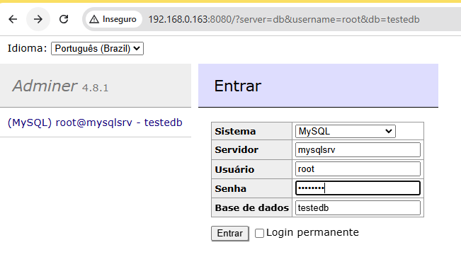
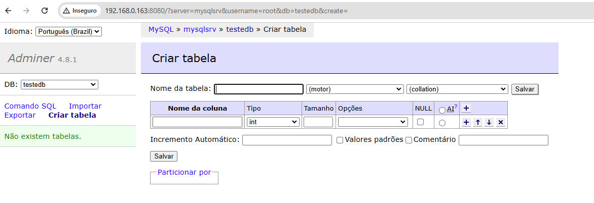
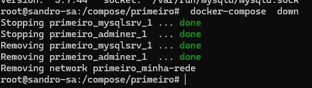
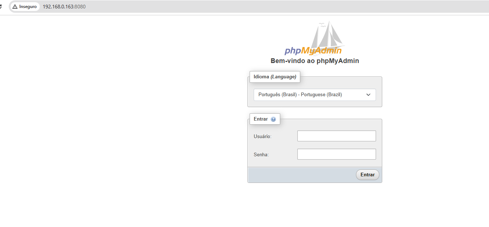
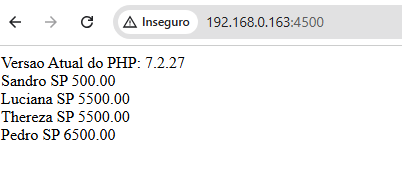
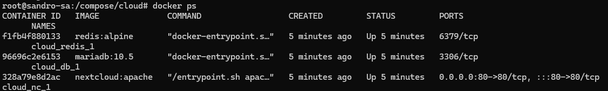
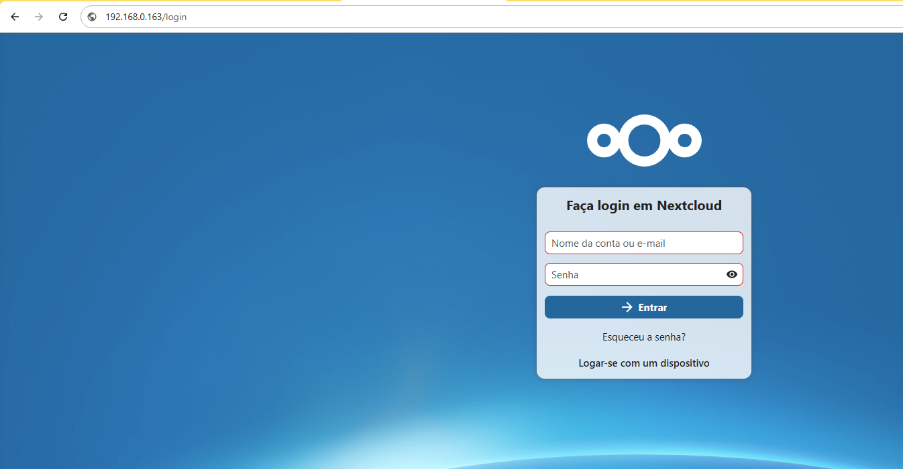
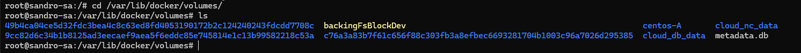

# DOCKER COMPOSER

## Introdução e instalação do Docker Compose

- instalando o Docker Composer

```bash
apt-get install -y docker-compose
docker-compose --version
```

- Preparando o ambiente

```bash
cd /data
mkdir mysql-C
cd ..
mkdir /compose
cd compose
mkdir primeiro
cd primeiro
nano docker-compose.yml
```


- Entendede o docker-compose.yml

```yml
# Utliliza a mesma versão do seu docker, seu uso e opcinal
#version: '3.7' 

# No primeiro serviço vamos usar uma imagem do utilizar mysql:5.7 e estamos dando o nome de mysqlsrv, com as configurações necessarias
services:
    mysqlsrv:
        image: mysql:5.7
        environment:
        MYSQL_ROOT_PASSWORD: "Senha123"
        MYSQL_DATABASE: "testedb"
        ports:
            - "3306:3306"
        volumes:
            - /data/mysql-C:/var/lib/mysql
        networks:
            - minha-rede

# No segundo serviço vamos usar um imagem do utilizar adminer, que e uma aplicaçao em php para gerenciar banco de dados e estamos dando o nome de adminer, com as configurações necessarias
  adminer:
    image: adminer
    ports:
        - 8080:8080
    networks:
        - minha-rede
# Criando a rede para a estrutura
networks: 
    minha-rede:
        driver: bridge

```

- versão para colocar no editor

```yml
version: '3.7'

services:
  mysqlsrv:
    image: mysql:5.7
    environment:
      MYSQL_ROOT_PASSWORD: "Senha123"
      MYSQL_DATABASE: "testedb"
    ports:
      - "3306:3306"
    volumes:
      - /data/mysql-C:/var/lib/mysql
    networks:
      - minha-rede

  adminer:
    image: adminer
    ports:
      - "8080:8080"
    networks:
      - minha-rede

networks:
  minha-rede:
    driver: bridge

```

- Executando os containers

```bash
    docker-compose up -d
```
- Verificando o ip do host

```bash
    ip a
```



- Parando os containers, e exclindo a rede 

## Docker Composer Down

```bash
    docker-compose  down
```


- Executando os containers em primeiro plano

```bash
    docker-compose up 
```
---

## Exemplo PHP APACHE MYSQL

- Preparando o ambiente

```bash
cd /data
mkdir php
cd php
mkdir admin 
nano uploads.ini
```
- Configurações do PHP

```ini
file_uploads = On
memory_limit = 500M
upload_max_filesize = 500M
post_max_size = 500M
max_execution_time = 600
max_file_uploads = 50000
max_execution_time = 5000
max_input_time = 5000

```
- Criando index.php

```bash
nano index.php
```

- index.php

```php
<html>

<head>
<title>Exemplo PHP</title>
</head>


<?php
ini_set("display_errors", 1);
header('Content-Type: text/html; charset=iso-8859-1');


echo 'Versao Atual do PHP: ' . phpversion() . '<br>';

$servername = "db";
$username = "root";
$password = "Senha123";
$database = "testedb";

// Criar conexão


$link = new mysqli($servername, $username, $password, $database);

/* check connection */
if (mysqli_connect_errno()) {
    printf("Connect failed: %s\n", mysqli_connect_error());
    exit();
}

$query = "SELECT * FROM tabela_exemplo";

if ($result = mysqli_query($link, $query)) {

    
    while ($row = mysqli_fetch_assoc($result)) {
        printf ("%s %s %s <br>", $row["nome"], $row["cidade"], $row["salario"]);
    }

    
    mysqli_free_result($result);
}


mysqli_close($link);

?>

</html>
```

```bash
cd ..
cd ..
cd compose
mkdir php-mysql
cd php-mysql
nano docker-compose.yml
```

- Vamos utilazaremos um serviço com a mesma imagem do MYSQL e o mesmo diretorio host /data/mysql-C
- Utilizaremos outro serviço com uma imagem customizada ja com o PHP Apache Alpine
-  O terceiro serviço vamas crar um client do PHPmyadmin
- Utilizaremos uma rede para isolar estes serviços

```yml
version: "3.7"

services:
  web:
    image: webdevops/php-apache:alpine-php7
    ports:
      - "4500:80"
    volumes:
      - /data/php/:/app

    networks:
      - minha-rede

  db:
    image: mysql:5.7
    environment:
      MYSQL_ROOT_PASSWORD: "Senha123"
      MYSQL_DATABASE: "testedb"
    ports:
      - "3306:3306"
    volumes:
      - /data/mysql-C:/var/lib/mysql

    networks:
      - minha-rede

  phpmyadmin:
    image: phpmyadmin/phpmyadmin
    environment:
      MYSQL_ROOT_PASSWORD: "Senha123"
    ports:
      - "8080:80"
    volumes:
      - /data/php/admin/uploads.ini:/usr/local/etc/php/conf.d/php-phpmyadmin.ini

    networks:
      - minha-rede

networks:
   minha-rede:
     driver: bridge
```

- Executando os containers

```bash
    docker-compose up -d
```

- Na porta 8080 temos o Phpmyadmin


- Na porta 4500 temos app



- Para funcionar o app e necessario a craição da tabela ``tabela_exemplo`` no testedb

- Adicione o quantos usuários quiser
```sql
CREATE TABLE `testedb`.`tabela_exemplo` (
  `id` INT AUTO_INCREMENT PRIMARY KEY, -- Coluna id como chave primária
  `nome` VARCHAR(100),                 -- Coluna nome como VARCHAR
  `cidade` VARCHAR(100),               -- Coluna cidade como VARCHAR
  `salario` DECIMAL(10, 2)             -- Coluna salario como DECIMAL (10 dígitos no total, 2 após a vírgula)
);

INSERT INTO `tabela_exemplo`( `nome`, `cidade`, `salario`) VALUES ( 'Sandro', 'SP', 500.00);
INSERT INTO `tabela_exemplo`( `nome`, `cidade`, `salario`) VALUES ( 'Luciana', 'SP', 5500.00);
INSERT INTO `tabela_exemplo`( `nome`, `cidade`, `salario`) VALUES ( 'Thereza', 'SP', 5500.00);
INSERT INTO `tabela_exemplo`( `nome`, `cidade`, `salario`) VALUES ( 'Pedro', 'SP', 6500.00);
```


```bash
    docker-compose down
```

---


## Utilizandos exemplos do github do docker

- Em [GitHub-Docker-Composer](https://github.com/docker/awesome-compose), temos alguns arquivos docker-compose.yml pronto para uso. Vamos utilizar  [nextcloud-redis-mariadb
](https://github.com/docker/awesome-compose/blob/master/nextcloud-redis-mariadb/compose.yaml), para testar. O next cloud e uma nuvem privada

- Abaixo o arquivo que você deverá encontra lá. Na documentação oficial diz que não precisa utilazar o parametro version, mas as vezes costumar dar erro sem ele.

```yml
version: "3.7"
services:
  nc:
    image: nextcloud:apache
    restart: always
    ports:
      - 80:80
    volumes:
      - nc_data:/var/www/html
    networks:
      - redisnet
      - dbnet
    environment:
      - REDIS_HOST=redis
      - MYSQL_HOST=db
      - MYSQL_DATABASE=nextcloud
      - MYSQL_USER=nextcloud
      - MYSQL_PASSWORD=nextcloud
  redis:
    image: redis:alpine
    restart: always
    networks:
      - redisnet
    expose:
      - 6379
  db:
    image: mariadb:10.5
    command: --transaction-isolation=READ-COMMITTED --binlog-format=ROW
    restart: always
    volumes:
      - db_data:/var/lib/mysql
    networks:
      - dbnet
    environment:
      - MYSQL_DATABASE=nextcloud
      - MYSQL_USER=nextcloud
      - MYSQL_ROOT_PASSWORD=nextcloud
      - MYSQL_PASSWORD=nextcloud
    expose:
      - 3306
volumes:
  db_data:
  nc_data:
networks:
  dbnet:
  redisnet:

  ```

- Criando a estrutura

```bash
cd /compose
mkdir cloud
cd cloud
nano docker-compose.yml # insera os dados do yml salve e feche
docker-compose up -d  # para subir os containers
```

- Após o container subir, verificamos se esta tudo ok 



- No navegador digite o ip com a porta, no primeiro acesso ele pede para criar um usuário, depois você tem acesso ao sistema.



- Os arquvios seram persistidos em volumes, conforme detalhado no arquivo.yml na pasta cloud_nc_data e cloud_db_data



- utilize ``docker-compose down`` para baixar os containers


