# DOCKER NA PRÁTICA

- Para este exemplo e necessário de uma estrutura em cloud ou fisica, com três servidores, estamos utilizando a amazon com a estrutura ... e nomeamos os servidores de aws-1, aws-2 e aws-3.
    - **OBS:** as portas do servidor para acesso ao mysql, apache e swarm, mencionadas adiante devem ser configuradas para liberar os acesso para seus respectivos usos na amazon
- já sabemos que para acessar estes servidores precisamos do ip, na amazon o ip pode ser visualizado no dashboard.
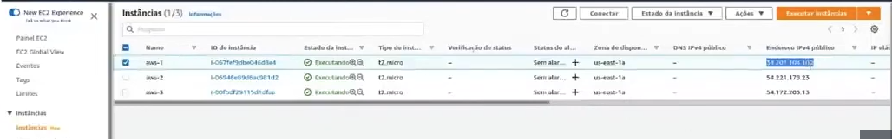

- Vamos subir um conatiner do [mysql](https://hub.docker.com/_/mysql)

- Como a ip publico podemos utilazar um client de banco de dados e acessa-lo não esqueça a senha e usuario

- Vamos cria uma tabela 

```sql

CREATE TABLE dados (
    AlunoID int,
    Nome varchar(50),
    Sobrenome varchar(50),
    Endereco varchar(150),
    Cidade varchar(50),
    Host varchar(50)
);

```
- Criando uma aplicação em PHP para testar

- Criando ambiente no aws1

```bash
cd /var/lib/docker/volumes
mkdir app
mkdir data
ls
```
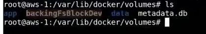

- Dentro do data estão os arquivos do banco e dados
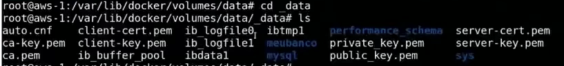

- Criando a aplicação 

```bash
cd app
mkdir _data
nano index.php
```

- Insera este código

```php
<html>

<head>
<title>Exemplo PHP</title>
</head>
<body>

<?php
ini_set("display_errors", 1);
header('Content-Type: text/html; charset=iso-8859-1');


echo 'Versao Atual do PHP: ' . phpversion() . '<br>';

$servername = "54.234.153.24";
$username = "root";
$password = "Senha123";
$database = "meubanco";

// Criar conexão


$link = new mysqli($servername, $username, $password, $database);

/* check connection */
if (mysqli_connect_errno()) {
    printf("Connect failed: %s\n", mysqli_connect_error());
    exit();
}

$valor_rand1 =  rand(1, 999);
$valor_rand2 = strtoupper(substr(bin2hex(random_bytes(4)), 1));
$host_name = gethostname();


$query = "INSERT INTO dados (AlunoID, Nome, Sobrenome, Endereco, Cidade, Host) VALUES ('$valor_rand1' , '$valor_rand2', '$valor_rand2', '$valor_rand2', '$valor_rand2','$host_name')";


if ($link->query($query) === TRUE) {
  echo "New record created successfully";
} else {
  echo "Error: " . $link->error;
}

?>
</body>
</html>

```

- Agora é preciso ter um servidor apache-php com a aplicação mapeada para dentro dele

```bash 
    docker run --name web-server -dt -p 80:80 --mount type=volume,src=app,dst=/app/ webdevops/php-apache:alpine-php7
```


- A cada refresh e inserido sao inseridos dados no banco simulado uma requisição no banco

- Agaro vamos fazer um teste de stress utilizando o [loader.io](https://loader.io/), faça uma conta para utilizar o serviço.

- Vamos criar um targe host


- Insira o seu dominio ou ip

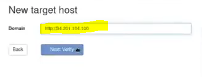

- Ele gera um hash, copie esse hash e crie no aws-1 um valor-do-hash.txt com o valor inserido nele

```bash
    cd /var/lib/docker/volumes/app/_data
    
    nano valor-do-hash.txt
```
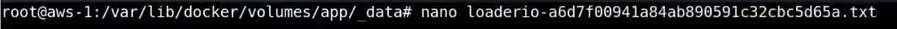

-  No txt insira o valor do hash
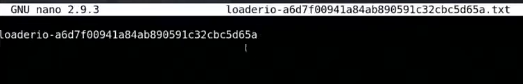

- Volte no loader.io e click em verify

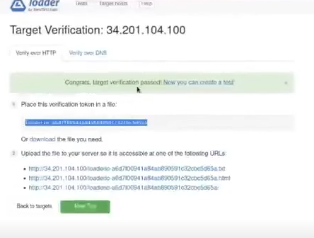

- Vá para teste, crie um novo, de um nome ao teste, e preencha o formulário com numero de cliente por teste, quantidade de cliente, duração, método GET, e caminho index.php

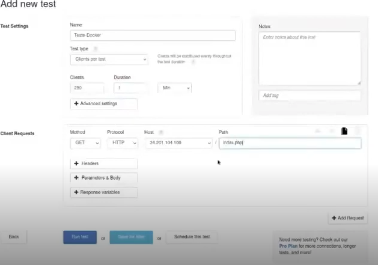

## Iniciado um cluster com Swarm

- Swarm e um cluster que gerencia o conatiner

```bash
    # PArando o conatiner
    docker rm --force web-server
    # inicia o swarm e  gera um toque que será utilizado nos outros servidores ele utiliza a porta 2377 que deve ser liberada na amazon
    docker swarm int
```


- Copie codigo fornecido e insera nos outro servidore aws-2 e aws-3
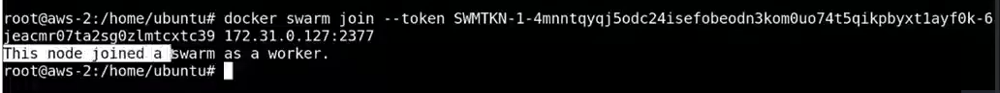
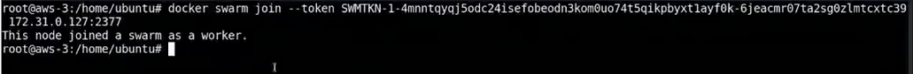

- Checar nós ou serviços pertencentes ao cluster ``docker node ls``
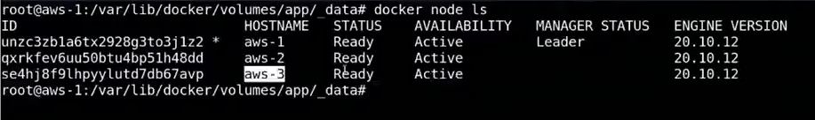

- Subindo o cluster no aws-1

```bash
    cd /var/lib/docker/volumes/app/_data
    docker service create --name web-server --replicas 10 -dt -p 80:80 --mount type=voume,src=app,dst=/app/ webdevops/php-apache:alpine-php7
```

- Este comando distribui os 10 container nos três nós ou servicos, mas não réplica o conteúdo, a solução réplicar os diretórios para os outros servidores via nfs.
- Criando servidor nfs no aws-1

```bash
    cd /var/lib/docker/volumes/app/_data
    apt-get install nfs-server
    nano /etc/exports
```

- Insira o caminho do diretório que será réplicado
```exports
# aqui estamos liberando para todos, nunca faça isso libere somente os ips dos servidores aws-2 e aws-3 /var/lib/docker/volumes/app/_data <IP_PERMITIDO>(rw,sync,subtree_check)
/var/lib/docker/volumes/app/_data *(rw,sync,subtree_check)
```
- Exportando e visualizando o que esta sendo exportado

```bash
    exportfs -ar
    showmount -e
```

- Criando cliente nfs no aws-2 e aws-3

```bash
    cd /var/lib/docker/volumes/app/_data
    apt-get install nfs-common
    mount -o v3 172.31.071:/var/lib/docker/volumes/app/_data /var/lib/docker/volumes/app/_data
```

## Criando um proxy com NGNIX

- No servidor aws-1

```bash
    cd /
    mkdir / proxy
    cd proxy
    nano nginx.conf
```
- Codígo para inserir no arquivo

```bash
http {
   
    upstream all {
        server 172.31.0.37:80;
        server 172.31.0.151:80;
        server 172.31.0.149:80;
    }

    server {
         listen 4500;
         location / {
              proxy_pass http://all/;
         }
    }

}


events { }
```

- Este arquivo tem que ser mapeado para o container do proxy que será criado

```bash
    nano dockerfile
```

```dockerfile
FROM nginx
COPY nginx.conf /etc/nginx/nginx.conf
```

```bash
    docker build -t proxy-app .
    docker container run --name my-proxy-app -dti -p 4500:4500 proxy-app
```

- Agora use o loader para estressar novamente, mas adicione a ao ip a porta 4500
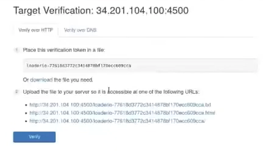

- Insira o novo hash e repita o teste de estresse criando novo teste

```bash
    cd /var/lib/docker/volumes/app/_data
    
    nano valor-do-hash.txt
```